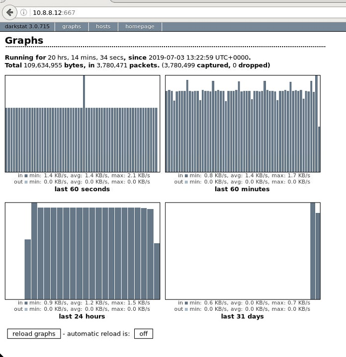

*************************************
vFWCL on Dublin ONAP offline platform
*************************************

|image0|

This document is collecting notes we have from running vFirewall demo on offline Dublin platform
installed by ONAP offline installer tool.

Overall it was much easier in compare with earlier version, however following steps are still needed.

Some of the most relevant materials are available on following links:

* `oom_quickstart_guide.html <https://docs.onap.org/en/dublin/submodules/oom.git/docs/oom_quickstart_guide.html>`_
* `docs_vfw.html <https://docs.onap.org/en/dublin/submodules/integration.git/docs/docs_vfw.html>`_

.. contents:: Table of Contents
   :depth: 2

Step 1. Preconditions - before ONAP deployment
==============================================

Understanding of the underlying OpenStack deployment is required from anyone applying these instructions.

In addition, installation-specific location of the helm charts on the infra node must be known.
In this document it is referred to as <helm_charts_dir>

Snippets below are describing areas we need to configure for successfull vFWCL demo.

Pay attention to them and configure it (ideally before deployment) accordingly.

**1) <helm_charts_dir>/onap/values.yaml**::

	#################################################################
	# Global configuration overrides.
	# !!! VIM specific entries are in APPC / Robot & SO parts !!!
	#################################################################
	global:
	  # Change to an unused port prefix range to prevent port conflicts
	  # with other instances running within the same k8s cluster
	  nodePortPrefix: 302
	  nodePortPrefixExt: 304

	  # ONAP Repository
	  # Uncomment the following to enable the use of a single docker
	  # repository but ONLY if your repository mirrors all ONAP
	  # docker images. This includes all images from dockerhub and
	  # any other repository that hosts images for ONAP components.
	  #repository: nexus3.onap.org:10001
	  repositoryCred:
	    user: docker
	    password: docker

	  # readiness check - temporary repo until images migrated to nexus3
	  readinessRepository: oomk8s
	  # logging agent - temporary repo until images migrated to nexus3
	  loggingRepository: docker.elastic.co

	  # image pull policy
	  pullPolicy: Always

	  # default mount path root directory referenced
	  # by persistent volumes and log files
	  persistence:
	    mountPath: /dockerdata-nfs
	    enableDefaultStorageclass: false
	    parameters: {}
	    storageclassProvisioner: kubernetes.io/no-provisioner
	    volumeReclaimPolicy: Retain

	  # override default resource limit flavor for all charts
	  flavor: unlimited

	  # flag to enable debugging - application support required
	  debugEnabled: false

	#################################################################
	# Enable/disable and configure helm charts (ie. applications)
	# to customize the ONAP deployment.
	#################################################################
	aaf:
	  enabled: true
	aai:
	  enabled: true
	appc:
	  enabled: true
	  config:
	    openStackType: "OpenStackProvider"
	    openStackName: "OpenStack"
	    openStackKeyStoneUrl: "http://10.20.30.40:5000/v2.0"
	    openStackServiceTenantName: "service"
	    openStackDomain: "default"
	    openStackUserName: "onap-tieto"
	    openStackEncryptedPassword: "31ECA9F2BA98EF34C9EC3412D071E31185F6D9522808867894FF566E6118983AD5E6F794B8034558"
	cassandra:
	  enabled: true
	clamp:
	  enabled: true
	cli:
	  enabled: true
	consul:
	  enabled: true
	contrib:
	  enabled: true
	dcaegen2:
	  enabled: true
	pnda:
	  enabled: true
	dmaap:
	  enabled: true
	esr:
	  enabled: true
	log:
	  enabled: true
	sniro-emulator:
	  enabled: true
	oof:
	  enabled: true
	mariadb-galera:
	  enabled: true
	msb:
	  enabled: true
	multicloud:
	  enabled: true
	nbi:
	  enabled: true
	  config:
	    # openstack configuration
	    openStackRegion: "Yolo"
	    openStackVNFTenantId: "1234"
	nfs-provisioner:
	  enabled: true
	policy:
	  enabled: true
	pomba:
	  enabled: true
	portal:
	  enabled: true
	robot:
	  enabled: true
	  appcUsername: "appc@appc.onap.org"
	  appcPassword: "demo123456!"
	  openStackKeyStoneUrl: "http://10.20.30.40:5000"
	  openStackPublicNetId: "9403ceea-0738-4908-a826-316c8541e4bb"
	  openStackPublicNetworkName: "rc3-offline-network"
	  openStackTenantId: "b1ce7742d956463999923ceaed71786e"
	  openStackUserName: "onap-tieto"
	  ubuntu14Image: "trusty"
	  openStackPrivateNetId: "3c7aa2bd-ba14-40ce-8070-6a0d6a617175"
	  openStackPrivateSubnetId: "2bcb9938-9c94-4049-b580-550a44dc63b3"
	  openStackPrivateNetCidr: "10.0.0.0/16"
	  openStackSecurityGroup: "onap_sg"
	  openStackOamNetworkCidrPrefix: "10.0"
	  dcaeCollectorIp: "10.8.8.22" # this IP is taken from k8s host
	  vnfPubKey: "ssh-rsa AAAAB3NzaC1yc2EAAAADAQABAAABAQDPwF2bYm2QuqZpjuAcZDJTcFdUkKv4Hbd/3qqbxf6g5ZgfQarCi+mYnKe9G9Px3CgFLPdgkBBnMSYaAzMjdIYOEdPKFTMQ9lIF0+i5KsrXvszWraGKwHjAflECfpTAWkPq2UJUvwkV/g7NS5lJN3fKa9LaqlXdtdQyeSBZAUJ6QeCE5vFUplk3X6QFbMXOHbZh2ziqu8mMtP+cWjHNBB47zHQ3RmNl81Rjv+QemD5zpdbK/h6AahDncOY3cfN88/HPWrENiSSxLC020sgZNYgERqfw+1YhHrclhf3jrSwCpZikjl7rqKroua2LBI/yeWEta3amTVvUnR2Y7gM8kHyh Generated-by-Nova"
	  demoArtifactsVersion: "1.4.0" # Dublin prefered is 1.4.0
	  demoArtifactsRepoUrl: "https://nexus.onap.org/content/repositories/releases"
	  scriptVersion: "1.4.0" # Dublin prefered is 1.4.0
	  rancherIpAddress: "10.8.8.8" # this IP is taken from infra node
	  config:
	    # instructions how to generate this value properly are in OOM quick quide mentioned above
	    openStackEncryptedPasswordHere: "f7920677e15e2678b0f33736189e8965"

	sdc:
	  enabled: true
	sdnc:
	  enabled: true

	  replicaCount: 1

	  mysql:
	    replicaCount: 1
	so:
	  enabled: true
	  config:
	    openStackUserName: "onap-tieto"
	    openStackRegion: "RegionOne"
	    openStackKeyStoneUrl: "http://10.20.30.40:5000"
	    openStackServiceTenantName: "services"
            # instructions how to generate this value properly are in OOM quick quide mentioned above
	    openStackEncryptedPasswordHere: "31ECA9F2BA98EF34C9EC3412D071E31185F6D9522808867894FF566E6118983AD5E6F794B8034558"

	  replicaCount: 1

	  liveness:
	    # necessary to disable liveness probe when setting breakpoints
	    # in debugger so K8s doesn't restart unresponsive container
	    enabled: true

	  so-catalog-db-adapter:
	    config:
	      openStackUserName: "onap-tieto"
	      openStackKeyStoneUrl: "http://10.20.30.40:5000/v2.0"
              #  instructions how to generate this value properly are in OOM quick quide mentioned above
	      openStackEncryptedPasswordHere: "31ECA9F2BA98EF34C9EC3412D071E31185F6D9522808867894FF566E6118983AD5E6F794B8034558"

	uui:
	  enabled: true
	vfc:
	  enabled: true
	vid:
	  enabled: true
	vnfsdk:
	  enabled: true
	modeling:
	  enabled: true

**2) <helm_charts_dir>/robot/resources/config/eteshare/config/vm_properties.py**::

        # following patch is required because in Dublin public network is hardcoded
        # reported in TEST-166 and is implemented in El-Alto
        # just add following row into file
        GLOBAL_INJECTED_OPENSTACK_PUBLIC_NETWORK = '{{ .Values.openStackPublicNetworkName }}'

Step 2. Preconditions - after ONAP deployment
=============================================

Run HealthChecks after successful deployment, all of them must pass

Relevant robot scripts are under <helm_charts_dir>/oom/kubernetes/robot

::

        [root@tomas-infra robot]# ./ete-k8s.sh onap health

        61 critical tests, 61 passed, 0 failed
        61 tests total, 61 passed, 0 failed

very useful page describing commands for `manual checking of HC’s <https://wiki.onap.org/display/DW/Robot+Healthcheck+Tests+on+ONAP+Components#RobotHealthcheckTestsonONAPComponents-ApplicationController(APPC)Healthcheck>`_

Step 3. Patch public network
============================

This is the last part of correction for `TEST-166 <https://jira.onap.org/browse/TEST-166>`_ needed for Dublin branch.

::

	[root@tomas-infra helm_charts]# kubectl  get pods -n onap | grep robot
	onap-robot-robot-5c7c46bbf4-4zgkn                              1/1     Running      0          3h15m
	[root@tomas-infra helm_charts]# kubectl  exec -it onap-robot-robot-5c7c46bbf4-4zgkn bash
        root@onap-robot-robot-5c7c46bbf4-4zgkn:/# cd /var/opt/ONAP/
	root@onap-robot-robot-5c7c46bbf4-4zgkn:/var/opt/ONAP# sed -i 's/network_name=public/network_name=${GLOBAL_INJECTED_OPENSTACK_PUBLIC_NETWORK}/g'  robot/resources/demo_preload.robot
        root@onap-robot-robot-5c7c46bbf4-4zgkn:/var/opt/ONAP# sed -i 's/network_name=public/network_name=${GLOBAL_INJECTED_OPENSTACK_PUBLIC_NETWORK}/g'  robot/resources/stack_validation/policy_check_vfw.robot
        root@onap-robot-robot-5c7c46bbf4-4zgkn:/var/opt/ONAP# sed -i 's/network_name=public/network_name=${GLOBAL_INJECTED_OPENSTACK_PUBLIC_NETWORK}/g'  robot/resources/stack_validation/validate_vfw.robot

Step 4. Set private key for robot when accessing VNFs
=====================================================

This is workaround for ticket `TEST-167 <https://jira.onap.org/browse/TEST-167>`_, as of now robot is using following file as private key
*/var/opt/ONAP/robot/assets/keys/onap_dev.pvt*

One can either set it to own private key, corresponding with public key inserted into VMs from *vnfPubKey* param
OR
set mount own private key into robot container and change GLOBAL_VM_PRIVATE_KEY in */var/opt/ONAP/robot/resources/global_properties.robot*

Step 5. robot init - demo services distribution
================================================

Run following robot script to execute both init_customer + distribute

::

        #  demo-k8s.sh <namespace> init

        [root@tomas-infra robot]# ./demo-k8s.sh onap init

Step 6. robot instantiateVFW
============================

Following tag is used for whole vFWCL testcase. It will deploy single heat stack with 3 VMs and set policies and APPC mount point for vFWCL to happen.

::

	# demo-k8s.sh <namespace> instantiateVFW

        root@tomas-infra robot]# ./demo-k8s.sh onap instantiateVFW

Step 7. fix CloseLoopName in tca microservice
=============================================

In Dublin scope, tca microservice is configured with hardcoded entries from `tcaSpec.json <https://gerrit.onap.org/r/gitweb?p=dcaegen2/analytics/tca.git;a=blob;f=dpo/tcaSpec.json;h=8e69c068ea47300707b8131fbc8d71e9a47af8a2;hb=HEAD#l278>`_

After updating operational policy within instantiateVFW robot tag execution, one must change CloseLoopName in tca to match with generated
value in policy. This is done in two parts:

a) get correct value

::

	# from drools container, i.e. drools in Dublin is not mapped to k8s host
	curl -k --silent --user 'demo@people.osaaf.org:demo123456!' -X GET  https://localhost:9696/policy/pdp/engine/controllers/usecases/drools/facts/usecases/controlloops --insecure

	# alternatively same value can be obtained from telemetry console in drools container
	telemetry
        https://localhost:9696/policy/pdp/engine> cd controllers/usecases/drools/facts/usecases/controlloops
        https://localhost:9696/policy/pdp/engine/controllers/usecases/drools/facts/usecases/controlloops> get
	HTTP/1.1 200 OK
	Content-Length: 62
	Content-Type: application/json
	Date: Tue, 25 Jun 2019 07:18:56 GMT
	Server: Jetty(9.4.14.v20181114)
	[
 	   "ControlLoop-vFirewall-da1fd2be-2a26-4704-ab99-cd80fe1cf89c"
	]

b) update the tca microservice

see Preconditions part in `docs_vfw.html <https://docs.onap.org/en/dublin/submodules/integration.git/docs/docs_vfw.html>`_
This step will be automated in El-Alto, it's tracked in `TEST-168 <https://jira.onap.org/browse/TEST-168>`_

Step 8. verify vFW
==================

Verify VFWCL. This step is just to verify CL functionality, which can be also verified by checking DarkStat GUI on vSINK VM <sink_ip:667>

::

       # demo-k8s.sh <namespace> vfwclosedloop <pgn-ip-address>
       # e.g. where 10.8.8.5 is IP from public network dedicated to vPKG VM
       root@tomas-infra robot]# ./demo-k8s.sh onap vfwclosedloop 10.8.8.5

