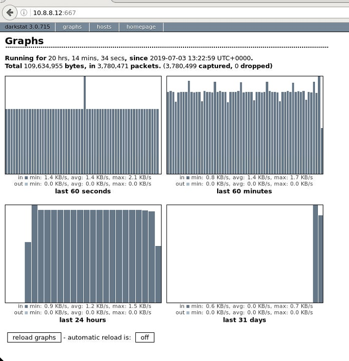

************************************
vFWCL on Ealto ONAP offline platform
************************************

|image0|

This document is collecting notes we have from running vFirewall demo on offline Elalto platform
installed by ONAP offline installer tool.

Overall it's slightly more complicated than in Dublin mainly due to POLICY-2191 issue.

Some of the most relevant materials are available on following links:

* `oom_quickstart_guide.html <https://docs.onap.org/en/elalto/submodules/oom.git/docs/oom_quickstart_guide.html>`_
* `docs_vfw.html <https://docs.onap.org/en/elalto/submodules/integration.git/docs/docs_vfw.html>`_

.. contents:: Table of Contents
   :depth: 2

Step 1. Preconditions - before ONAP deployment
==============================================

Understanding of the underlying OpenStack deployment is required from anyone applying these instructions.

In addition, installation-specific location of the helm charts on the infra node must be known.
In this document it is referred to as <helm_charts_dir>

Snippets below are describing areas we need to configure for successfull vFWCL demo.

Pay attention to them and configure it (ideally before deployment) accordingly.

.. note:: We are using standard OOM kubernetes/onap/resources/overrides/onap-all.yaml override to enable all components, however looks that better tailored one onap-vfw.yaml exists in the same folder. In following description we would be focusing on just other override values specific for lab environment.

**1) Override for Update APPC / Robot and SO parts**::

    appc:
          enabled: true
          config:
            openStackType: "OpenStackProvider"
            openStackName: "OpenStack"
            openStackKeyStoneUrl: "http://10.20.30.40:5000/v2.0"
            openStackServiceTenantName: "service"
            openStackDomain: "default"
            openStackUserName: "onap-tieto"
            openStackEncryptedPassword: "31ECA9F2BA98EF34C9EC3412D071E31185F6D9522808867894FF566E6118983AD5E6F794B8034558"
        robot:
          enabled: true
          appcUsername: "appc@appc.onap.org"
          appcPassword: "demo123456!"
          openStackKeyStoneUrl: "http://10.20.30.40:5000"
          openStackPublicNetId: "9403ceea-0738-4908-a826-316c8541e4bb"
          openStackTenantId: "b1ce7742d956463999923ceaed71786e"
          openStackUserName: "onap-tieto"
          ubuntu14Image: "trusty"
          openStackPrivateNetId: "3c7aa2bd-ba14-40ce-8070-6a0d6a617175"
          openStackPrivateSubnetId: "2bcb9938-9c94-4049-b580-550a44dc63b3"
          openStackPrivateNetCidr: "10.0.0.0/16"
          openStackSecurityGroup: "onap_sg"
          openStackOamNetworkCidrPrefix: "10.0"
          openStackPublicNetworkName: "rc3-offline-network"
          vnfPrivateKey: '/var/opt/ONAP/onap-dev.pem'
          vnfPubKey: "ssh-rsa AAAAB3NzaC1yc2EAAAADAQABAAABAQDPwF2bYm2QuqZpjuAcZDJTcFdUkKv4Hbd/3qqbxf6g5ZgfQarCi+mYnKe9G9Px3CgFLPdgkBBnMSYaAzMjdIYOEdPKFTMQ9lIF0+i5KsrXvszWraGKwHjAflECfpTAWkPq2UJUvwkV/g7NS5lJN3fKa9LaqlXdtdQyeSBZAUJ6QeCE5vFUplk3X6QFbMXOHbZh2ziqu8mMtP+cWjHNBB47zHQ3RmNl81Rjv+QemD5zpdbK/h6AahDncOY3cfN88/HPWrENiSSxLC020sgZNYgERqfw+1YhHrclhf3jrSwCpZikjl7rqKroua2LBI/yeWEta3amTVvUnR2Y7gM8kHyh Generated-by-Nova"
          demoArtifactsVersion: "1.4.0"
          demoArtifactsRepoUrl: "https://nexus.onap.org/content/repositories/releases"
          scriptVersion: "1.4.0"
          config:
            # openStackEncryptedPasswordHere should match the encrypted string used in SO and APPC and overridden per environment
            openStackEncryptedPasswordHere: "f7920677e15e2678b0f33736189e8965"
        so:
          enabled: true
          config:
            openStackUserName: "onap-tieto"
            openStackRegion: "RegionOne"
            openStackKeyStoneUrl: "http://10.20.30.40:5000"
            openStackServiceTenantName: "services"
            openStackEncryptedPasswordHere: "31ECA9F2BA98EF34C9EC3412D071E31185F6D9522808867894FF566E6118983AD5E6F794B8034558"
          so-catalog-db-adapter:
            config:
              openStackUserName: "onap-tieto"
              openStackKeyStoneUrl: "http://10.20.30.40:5000/v2.0"
              openStackEncryptedPasswordHere: "31ECA9F2BA98EF34C9EC3412D071E31185F6D9522808867894FF566E6118983AD5E6F794B8034558"

Step 2. Preconditions - after ONAP deployment
=============================================

Run HealthChecks after successful deployment, all of them must pass

Relevant robot scripts are under <helm_charts_dir>/oom/kubernetes/robot

::

        [root@tomas-infra robot]# ./ete-k8s.sh onap health

        61 critical tests, 61 passed, 0 failed
        61 tests total, 61 passed, 0 failed

very useful page describing commands for `manual checking of HC’s <https://wiki.onap.org/display/DW/Robot+Healthcheck+Tests+on+ONAP+Components#RobotHealthcheckTestsonONAPComponents-ApplicationController(APPC)Healthcheck>`_

Unfortunatelly some patching is still required to get vFWCL working on ONAP plaform.
Therefore we provided a bunch of files and put them into ./patches folder within this repo.

After installation is finished and all healthchecks are green it is still required to patch few things.
Those will be described in following part.

Step 3. Patching
============================

In order to get vFWCL working in our lab on offline platform, we need to ensure 3 things except healthecks prior proceeding
with official instructions.

**robot**
a) private key for robot has to be configured properly and contain key present on robot pod

::

    # open configmap for robot and check GLOBAL_INJECTED_PRIVATE_KEY param
    kubectl edit configmap onap-robot-robot-eteshare-configmap
    # it should contain stuff like
    # GLOBAL_INJECTED_PRIVATE_KEY = '/var/opt/ONAP/onap-dev.pem'

we need to put some private key for that and that key must match with public key distributed to vFWCL VMs which is
coming from *vnfPubKey* parameter in robot

b) in our lab there is some issue with cloud-init and vFW VMs are getting default route set quite randomly,
which is an issue as in our lab we specified following dedicated network for vFW VMs public connectivity.

.. note:: same network has to be reachable from k8s host where robot container is

+--------------------------------------+----------------------------------------------+----------------------------------+-------------------------------------------------------+
| id                                   | name                                         | tenant_id                        | subnets                                               |
+--------------------------------------+----------------------------------------------+----------------------------------+-------------------------------------------------------+
| 9403ceea-0738-4908-a826-316c8541e4bb | rc3-offline-network                          | b1ce7742d956463999923ceaed71786e | 1782c82c-cd92-4fb6-a292-5e396afe63ec 10.8.8.0/24      |
+--------------------------------------+----------------------------------------------+----------------------------------+-------------------------------------------------------+

for this reason we are patching *base_vfw.yaml* for all vFW VMs with following code

::

    # nasty hack to bypass cloud-init issues
    sed  -i '1i nameserver 8.8.8.8' /etc/resolv.conf
    iface_correct=`ip a | grep 10.8.8 | awk {'print $7'}`
    route add default gw 10.8.8.1 ${iface_correct}

Lets treat it as an example of how these two problems can be fixed. Feel free to adjust private/public key and skip cloud-init problem if you don't have it.
Our helping script with above setting is fixing both issues (a) and (b) for us.

::

    # copy offline-installer repo into infra node and run following script from patches folder
    ./update_robot.sh

**drools**
c) usecases controller is not working - POLICY-2191

There are couple of pom files required in order to get usecases controller in drools pod instantiated properly.
One can fix it by running following script.

::

    # copy offline-installer repo into infra node and run following script from patches folder
    ./update_policy.sh

.. note:: This script is also restarting policy, there is some small chance that drools will be marked as sick during interval its being restarted and redeployed. If it happens, just try again.

At this moment one can check that usecases controller is build properly via:

::

    # on infra node
    kubectl  exec -it onap-policy-drools-0 bash
    bash-4.4$ telemetry
    Version: 1.0.0
    https://localhost:9696/policy/pdp/engine> get controllers
    HTTP/1.1 200 OK
    Content-Length: 24
    Content-Type: application/json
    Date: Mon, 04 Nov 2019 06:31:09 GMT
    Server: Jetty(9.4.20.v20190813)
    
    [
        "amsterdam",
        "usecases"
    ]

Now we can proceed with same steps as on online platform.

Step 4. robot init - demo services distribution
================================================

Run following robot script to execute both init_customer + distribute

::

        #  demo-k8s.sh <namespace> init

        [root@tomas-infra robot]# ./demo-k8s.sh onap init

Step 5. robot instantiateVFW
============================

Following tag is used for whole vFWCL testcase. It will deploy single heat stack with 3 VMs and set policies and APPC mount point for vFWCL to happen.

::

	# demo-k8s.sh <namespace> instantiateVFW

        root@tomas-infra robot]# ./demo-k8s.sh onap instantiateVFW

Step 6. verify vFW
==================

Verify VFWCL. This step is just to verify CL functionality, which can be also verified by checking DarkStat GUI on vSINK VM <sink_ip:667>

::

       # demo-k8s.sh <namespace> vfwclosedloop <pgn-ip-address>
       # e.g. where 10.8.8.5 is IP from public network dedicated to vPKG VM
       root@tomas-infra robot]# ./demo-k8s.sh onap vfwclosedloop 10.8.8.5

